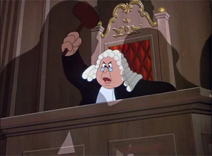

  
                                                          
                                                                                
  # Fairness Trade-offs on German Credit                                     
                                                                                
                                     
                                                                                
  ### *Are we fair?*  

❯ Comment évaluer l'équité d'un modèle de scoring crédit envers les jeunes        
emprunteurs, et jusqu'où les techniques classiques de mitigation                
permettent-elles de la rétablir ?  

---
                                                                                
1. Comment concilier équité algorithmique et viabilité économique dans un       
système de scoring crédit ?                                                     
                                                                                
2. Quelles sont les limites des techniques classiques de mitigation des biais,  
et d'où proviennent ces limites ?                                               
                                                                                
3. Que nous apprennent les outils d'interprétation sur la nature réelle des     
biais observés ?                                                                

